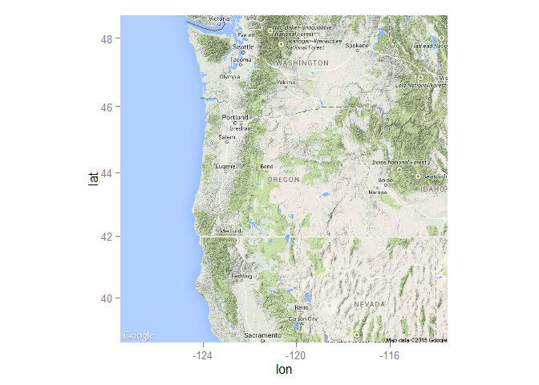

# Create a basemap (to use later)

For any cemetery project, it may be useful to have on hand a map of the area. We can easily produce a basemap onto which we can later plot spatial data on a cemetery (e.g., boundaries, locations of plots). R's ability to handle and visualize spatial data have grown rapidly over the years. Below, I present an incredibly simple way to produce a map layer in R. For more, see Roger Bivand and colleague's [_Applied Spatial Analysis with R_](http://www.springer.com/us/book/9781461476177) (2013). 

First, I will load some required packages.


```r
# Load required libraries
spatpack <- c("ggplot2", "ggmap", "ggthemr", "rgdal", "scales", "dplyr", "Cairo", "shiny", "ggvis", "maptools", "sp", "spatial")
sapply(spatpack, require, character.only = TRUE)
gpclibPermit()
```

I hope that worked. Next I'll use `ggmap` to get our map layer.


```r
or.map <- get_map(location = "Oregon", source = "google", maptype = "terrain", zoom = 6)
ggmap(or.map)
```

 
